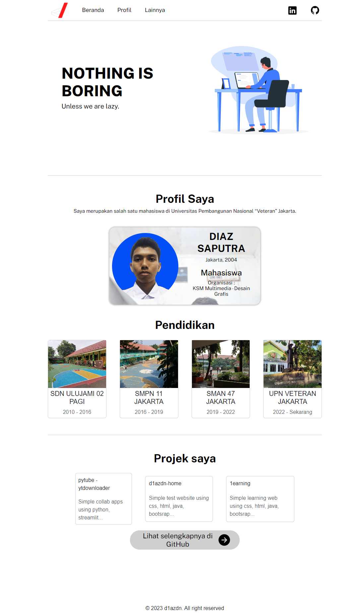

# d1azdn - Home
Simple test website using css, html, java and bootsrap.
<br/>
This website can be used as learning material because the features used are simple features. Using CSS, Html and Js programming languages, also assisted by the Bootstrap library and imported Google fonts.
<br/><br/>
*Website ini dapat dijadikan bahan pembelajaran umum karena fitur yang digunakan merupakan fitur-fitur sederhana. Menggunakan bahasa pemograman CSS, Html dan Js serta dibantu oleh library Bootstrap dan import font google.*

## Project results


## Getting Started
There is no need to install any packages, instead download this project or clone it
<br/><br/>
*Tidak perlu mendownload library apapun, dapat langsung download project atau clone github ini*


## Workflow
See on : https://d1azdn.github.io
- Header = navbar
- Main = topbar, my-profile, my-education, my-project
- Footer = copyright

## Clone
```bash
git clone https://github.com/d1azdn/d1azdn.github.io
```
